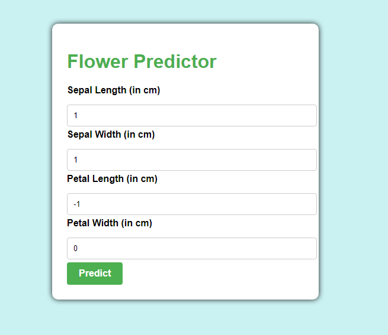

# Flower Prediction:



# Iris Flower Classification Web App

This Django web application uses a trained RandomForestClassifier to predict the species of an Iris flower based on its sepal and petal dimensions. The model is trained on the famous Iris dataset.

## Requirements

- Python 3.x
- Django
- scikit-learn
- joblib

## Installation

1. **Clone the repository:**

    ```bash
    git clone https://github.com/zabih-khan/Flower-prediction.git
    ```

2. **Install the required packages:**

    ```bash
    pip install -r requirements.txt
    ```

## Usage

1. **Run the Django development server:**

    ```bash
    python manage.py runserver
    ```

2. **Open your web browser and navigate to [http://127.0.0.1:8000/](http://127.0.0.1:8000/) to access the application.**

3. **Enter the sepal and petal dimensions in the form and submit to get the predicted Iris flower species.**

## Project Structure

- **irisApp:** Django app containing the web application.
  - **views.py:** Django views for rendering pages and handling predictions.
  - **templates:** HTML templates for rendering web pages.

- **savedModels:** Directory to store the trained model using joblib.

## Files

- **train_model.ipynb:** Jupyter Notebook for training the RandomForestClassifier on the Iris dataset and saving the model using joblib.

- **main.html:** Main page template for entering flower dimensions.

- **result.html:** Result page template displaying the predicted flower species.


